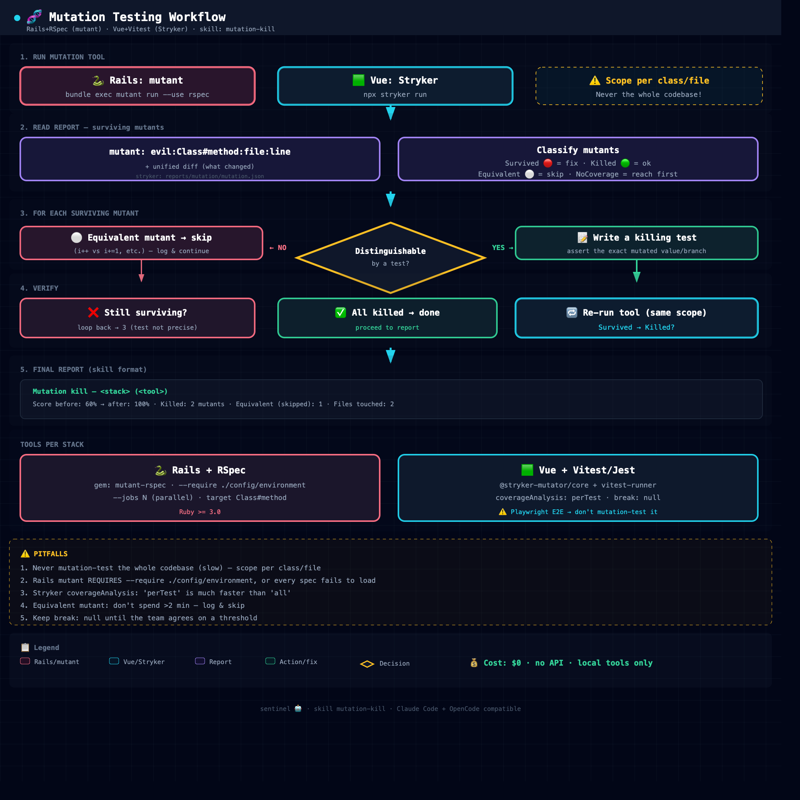

# Sentinel 🤖

**Hunt and kill surviving mutants.** Mutation testing toolkit: an AI skill
(`mutation-kill`) + ready-to-run example projects for **Rails + RSpec** (`mutant`
gem) and **Vue + Vitest** (Stryker).

---

## Workflow / Alur kerja



Open the interactive diagram: [`flowchart/mutation-testing-workflow.html`](flowchart/mutation-testing-workflow.html)

---

## 🇬🇧 English

### What is mutation testing?

Mutation testing checks **how good your tests really are**. The tool mutates
your code (flips `>` to `>=`, changes `0.9` to `0.8`, deletes a condition) and
runs your tests. A mutation your tests *don't* catch is a **surviving mutant** —
a gap in your test suite.

### What's inside

```
sentinel/
├── README.md
├── skills/
│   └── mutation-kill/SKILL.md           # AI skill (Claude Code + OpenCode)
├── docs/
│   └── mutation-testing-explained.md    # Bilingual plain-language guide
├── examples/
│   ├── rails-rspec/                     # Ruby + RSpec + mutant
│   └── vue-vitest/                      # JS + Vitest + Stryker
└── flowchart/
    ├── mutation-testing-workflow.html   # Interactive diagram
    └── mutation-testing-workflow.png    # Diagram screenshot
```

### Install the skill

```bash
# Claude Code (user-level)
cp -r skills/mutation-kill ~/.claude/skills/

# OpenCode (user-level)
cp -r skills/mutation-kill ~/.config/opencode/skills/

# Or project-level (commit it with the repo)
cp -r skills/mutation-kill ./.claude/skills/     # Claude Code
cp -r skills/mutation-kill ./.opencode/skills/   # OpenCode
```

Trigger: say **"kill mutants"**, **"bunuh mutant"**, **"naikin mutation score"**.

### Run the examples

```bash
# Rails + RSpec (requires Ruby >= 3.0)
cd examples/rails-rspec && bundle install
bundle exec rspec
bundle exec mutant run --use rspec --include lib "Pricing.calculate"

# Vue + Vitest
cd examples/vue-vitest && npm install
npx stryker run
```

---

## 🇮🇩 Bahasa Indonesia

### Apa itu mutation testing?

Mutation testing ngecek **seberapa bagus test kamu sebenarnya**. Tool-nya mutasi
kode kamu (balik `>` jadi `>=`, ganti `0.9` jadi `0.8`, hapus kondisi) lalu
jalanin test. Mutasi yang *tidak* ketangkep test = **surviving mutant** — celah
di test suite kamu.

### Isi repo

```
sentinel/
├── README.md
├── skills/
│   └── mutation-kill/SKILL.md           # Skill AI (Claude Code + OpenCode)
├── docs/
│   └── mutation-testing-explained.md    # Penjelasan sederhana bilingual
├── examples/
│   ├── rails-rspec/                     # Ruby + RSpec + mutant
│   └── vue-vitest/                      # JS + Vitest + Stryker
└── flowchart/
    ├── mutation-testing-workflow.html   # Diagram interaktif
    └── mutation-testing-workflow.png    # Screenshot diagram
```

### Install skill

```bash
# Claude Code (user-level)
cp -r skills/mutation-kill ~/.claude/skills/

# OpenCode (user-level)
cp -r skills/mutation-kill ~/.config/opencode/skills/

# Atau project-level (ke-commit bareng repo)
cp -r skills/mutation-kill ./.claude/skills/     # Claude Code
cp -r skills/mutation-kill ./.opencode/skills/   # OpenCode
```

Trigger: bilang **"kill mutants"**, **"bunuh mutant"**, **"naikin mutation score"**.

### Jalankan contoh

```bash
# Rails + RSpec (butuh Ruby >= 3.0)
cd examples/rails-rspec && bundle install
bundle exec rspec
bundle exec mutant run --use rspec --include lib "Pricing.calculate"

# Vue + Vitest
cd examples/vue-vitest && npm install
npx stryker run
```

---

## 📚 More docs / Dokumen lain

- [`docs/mutation-testing-explained.md`](docs/mutation-testing-explained.md) — plain-language guide (EN + ID), includes **unit test vs mutation testing** comparison.
